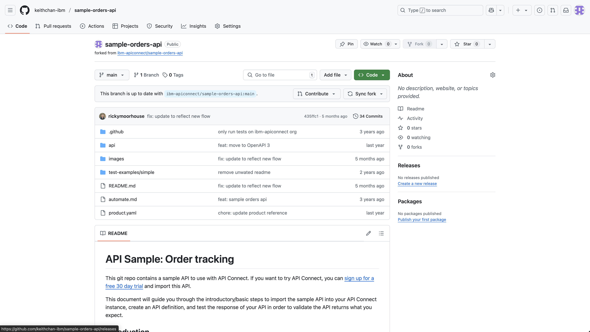
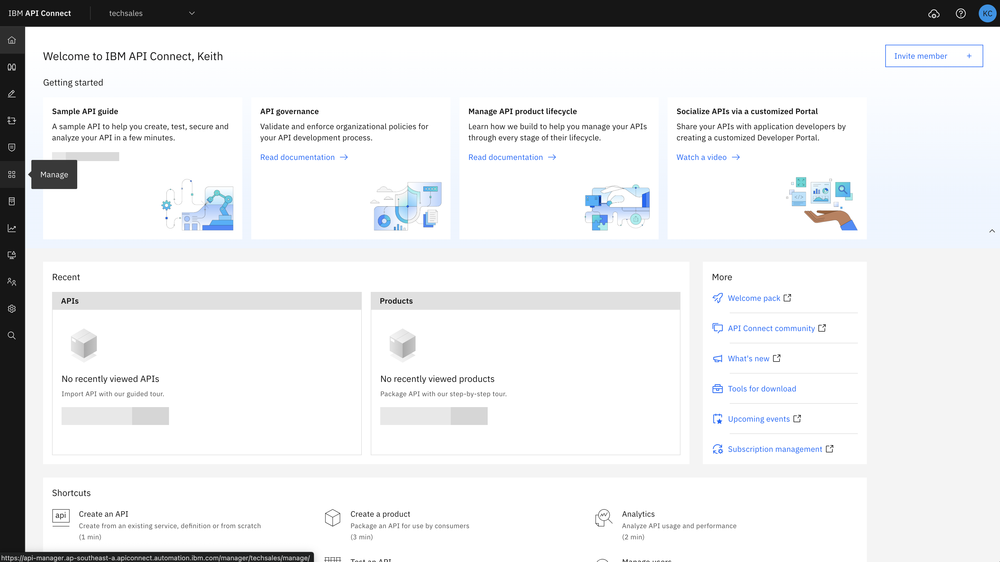

# API Sample: Order tracking

This git repo contains a sample API to use with API Connect as part of T3 Training.

This document will guide you through the introductory/basic steps to import the sample API into your API Connect instance, create an API definition, and test the response of your API in order to validate the API returns what you expect.

## Introduction
### About this sample

We have all purchased something online where after your payment is processed, you receive a tracking number to track your package. This API demonstrates how you can build a composite API within API Connect that combines data from two different back-end sources -- our order fulfillment system and the delivery company’s shipment tracking -- to provide an order tracking API for App Developers to build on. 

This API takes the input of an order number and then uses it to query our mock internal order system to return the status of the order. Within the order status returned we have the details of which delivery company the parcel was shipped with and the associated tracking reference. The API then passes these to an AWS Lambda function to look up the parcel status from the appropriate shipping company.

### Purpose of this tutorial:

This tutorial demonstrates how you can develop test, secure, socialize and analyze your API usage.

 - First, you will import the sample API into your API Connect instance and activate it.
 - Then, you will explore the API definition to see how it works.
 - Then, you will publish the API into a product
 - Then, you will test the response of your API to validate that it works correctly.
 - Then you will use the analytics feature to review and analyse your API's usage.
 - Finally, you will use the API lifecycle features of API Connect to keep the API updated as your systems evolve.

## Step by step guide:

Start to develop and test your API by completing the following 6 simple steps: 

### Step 1. Click here to access the [sample API definition](https://raw.githubusercontent.com/keithchan-ibm/sample-orders-api/refs/heads/main/api/orders_api.yaml) 

 - Navigate to the API folder.
   
 - Download the `orders_api.yaml` file or create new file locally and copy its content into it.
   
- Update attributes following attributes in the file to append your name/initials then save the changes:
  - title
  - x-ibm-name
  - url
  ```
  info:
    title: order-<name/initials>
    description: View and track your orders and deliveries.
    termsOfService: https://github.com/keithchan-ibm/sample-orders-api
    contact:
      name: IBM Corporation
      url: https://www.ibm.com/products/api-connect
    version: 2.0.0
    x-ibm-name: sample-order-api-<name/initials>
  externalDocs:
    description:
      "Github project for this API, containing source code and deployment\
      \ pipeline"
    url: https://github.com/keithchan-ibm/sample-orders-api
  servers:
    - url: /order-<name/initials>
  ```

  Example:
  ```
  info:
    title: order-kc
    description: View and track your orders and deliveries.
    termsOfService: https://github.com/keithchan-ibm/sample-orders-api
    contact:
      name: IBM Corporation
      url: https://www.ibm.com/products/api-connect
    version: 2.0.0
    x-ibm-name: sample-order-api-kc
  externalDocs:
    description:
      "Github project for this API, containing source code and deployment\
      \ pipeline"
    url: https://github.com/keithchan-ibm/sample-orders-api
  servers:
    - url: /order-kc
  ```

### Step 2. Import the sample to your API Connect instance

 - Navigate to the API Connect Console at [APIC on AWS (South East Asia)](https://api-manager.ap-southeast-a.apiconnect.automation.ibm.com/manager/). 
  
   **Note: As part of APAC T3, you should have receive an invitation email to this environment. Check your email and accept the invite.**
   
 - In the homepage, select Develop to create an API.
 

 - Select Add -> API .
 
 
 - On the _Select API type_ page, select the OpenAPI 3.0 tab selected and under “_Import_”, select “_Existing OpenAPI_”. Click Next. 
  

 - In the "Select a file" field, upload the file from from Step 1 and confirm validation is successful.  Click Next. 
  
   **Note: if you have previously imported the same API you will need to delete it before importing it again.**
   

 -  Select “_Edit API_” to open the API editor, where you can modify, publish, and test your API. 
  

### Step 3. Explore the API definition
You are now in the API Editor, where you can view and edit API definitions. 
  - The “Design” tab displays details about your API definition. The navigation list lets you easily drill down to each OpenAPI object in the definition. Click through the different objects in the navigation list to view the API’s definition, such as the operations it performs and the corresponding responses.
  

  - Select the “Gateway” tab to view the flow of "policies" (operations) in the API.
  
  - The policies used in an API are represented as a schematic in the API Assembler to show the order of execution; click any policy to view its details.
    The sample API uses the following policies: 
    - **order lookup**:  An invoke policy that calls the order fulfillment system to retrieve the order details for the provided order number (such as “order status” ,“ shipping carrier”, and “tracking number”). 
    - **parse response**:  The gateway parses the JSON response containing the order details so the values can be used later in the flow.
    - **map input to lambda**: Takes the “tracking number” from the order details to build the input needed for invoking the AWS Lambda function in the next policy in the flow.
    - **lambda: track shipment**:  Calls the Lambda function to look up the tracking data for the retrieved tracking number and shipping carrier.
    - **combine data for response**: The map policy takes  the responses from “order lookup” and “lambda: track shipment” policies and combine them into a single output so when the customer calls this API, they get both the order details from the company order database and the shipping status from the carrier.

<!--   -->
### Step 4: Publish your API
Now, let's publish our API:
  - Select the "_Test_" tab to switch to the Test page.
 
  - Select the "_Target Configuration_" to configure the publish preferences.
 
  - Set the "_Target catalog_" to `APAC T3`.
 
  - Set the "_Target product_" to `apac-t3-product`.
 
  - Set the "_Target application_" to `apac-t3-app`.
 
  - Confirm the 3 preferences are correctly configured then click `Save Preferences`
  
  - Next, click the 3 dots beside "Save" and select `Publish`
  
  - Select `Existing Product`, search for `apac-t3-product`, select it and click `Next`
  
  - Search for `APAC-T3`, select it and click `Next`
  
  - Leave the default settings and click `Publish`
  
  - Confirm the successful notification for API published
  
  <!-- - After publishing, the next step is to assign a subscription plan for the API. Navigate to `APAC T3` Catalog and select the _Application_ tab
  
  - Click the 3 dots belonging to `apac-t3-app` and choose the plan to create subscription for the API
   -->
### Step 5: Test your API
Now, let's do a simple test:
  - Navigate back to the API Designer and select the "_Explorer_" tab to switch to the Explorer page.
 
  - Select the GET endpoint on the left, provide a random orderNumber and click Send
 
  - Confirm the request is successful with the returned payload
 

Next, let's test and check the API call trace:
  - In API Designer, select the "_Test_" tab to switch to the Test page.
  
  - In the “_Request_” section, type any value for the “_order-number_” field in the parameters list and click “_Send_”. 
  
  - You can now see the tracking details in the “Response” section, with:.
    - The order “created_at” date, “status”, and “shipped_at” date showing the data from the order fulfillment system
    - The "tracking_status" showing the data from the shipping company
 

  - In the “Response” section, select the “Trace” tab to view how the API call was executed. Tracing the API’s execution helps when you need to debug your API. 
  

  - Let's next test the API security, delete the "_x-IBM-Client-ID_" field in the parameter list.
  
  - Click "_Send_" to send this new request without the Security field.
  
  - Check and confirm that a 401 unauthorized response is returned.
  

### Step 6: Analyze your API calls and responses in the analytics dashboard. 

**Note:** _As this is a demo/test environment, APIC may struggle to analyse the large amount of APIs in the environment using the default filter of 30 days. Ensure you change the filter to a smaller time window of 30 minutes or less. It may occur that browser reports the page is not responding, click wait to give time for the data to be loaded._

 - Navigate to the catalog view by selecting the _Manage_ icon on the the left toolbar and select `APAC-T3`
  
  
 - Select the _Analytics_ tab
  
 - Update the filter time range to a smaller window
  
API Dashboard:

 - Start by exploring the “API Dashboard” across different tabs. This dashboard shows the API calls that were made within this your service instance. Display charts summarize total API calls, response codes, and response times. 
 

 - Navigate back to Analytics and click the "Discover” tab to see the individual API calls. Click each call to view the steps that the API executed.
 
 
 

<!-- 
Product Dashboard:

 - Products is a way to group your APIs into a product so consumers can subscribe to your product which is a set up APIs. Displays chart show total API calls and application subscriptions per plan (plans determine access to APIs and manage API usage. 

Monitoring Latency Dashboard:

 - Displays charts containing response time statistics and data usage to help analyze performance when you have a lot of traffics. 

Monitoring Status Dashboard: 

 - Displays charts that show the response codes and success/failure rates of API calls.

Usage Dashboard: 

 - Displays charts that show the top 5 APIs, products, and applications.

Consumption Dashboard: 

Displays a chart showing the total API consumption in your service instance. -->


**DONE:** Great work! You just finished creating, testing and analysing your order tracking sample API.  🎉🎉🎉 


<!-- ## Next Steps

Now you have an API with which you can explore some of the other capabilities of API Connect.  We will be updating this guide with additional steps to help you perform the following advanced tasks:  

 - [**Secure**](https://www.ibm.com/docs/en/api-connect/saas?topic=apis-security-authentication) your API with additional security requirements such as OAuth
 - [**Automate**](automate.md)  your API deployment as part of a CI/CD pipeline
 - [**Socialize**](https://www.ibm.com/docs/en/api-connect/saas?topic=developer-portal-socialize-your-apis) your API  by sharing it with your customers in a Developer Portal -->

## Support
This is a publicly available sample and comes with no guarantees. At the time of publishing, the API Connect product and the sample API perform as described in this tutorial. If you have any questions, you can visit the [API Connect user community](https://ibm.biz/APIC_User_Community) page to read other users’ questions and ask your own questions.


<!-- ## Test Sample Order API with APIC cli
#### Step 1: Download and Install APIC Toolkit
To begin testing APIs using APIC CLI, it is essential to download and install the APIC toolkit. Detailed instructions for this process can be accessed [here](https://www.ibm.com/docs/en/api-connect/10.0.x?topic=configuration-installing-toolkit).

#### Step 2: Create and Execute Tests
To initiate the testing process, follow the steps outlined in the documentation below. 

- [Test Sample Order API](./test-examples/simple/README.md) -->